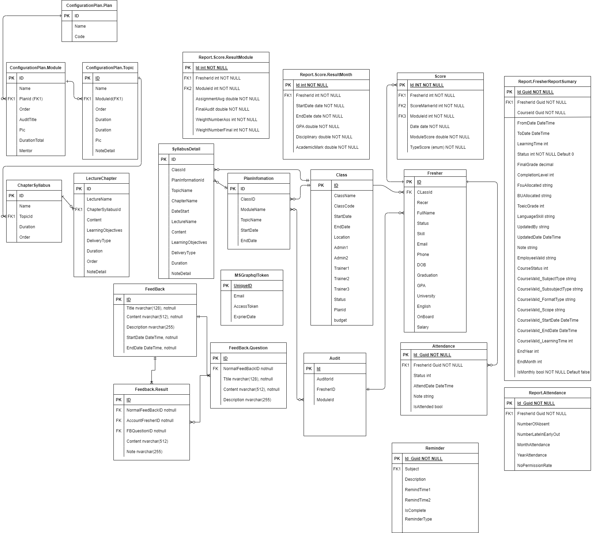

# running FE project readfile read me in the www project

# running project with VS Code from the Apis Folder
```
dotnet run --project webapi
```

# running unit test & test coverage
## setup. install the tool that will generate the report after run test collect data
```
dotnet tool install -g dotnet-reportgenerator-globaltool
```

## step 1. in the ROOT Repository of project run command this
```
dotnet test fresher-managerment-sln.sln --collect:"XPlat Code Coverage"
```
## step 2. Generate html report

```
reportgenerator -reports:Tests/**/coverage.cobertura.xml -targetdir:"Tests\CoverageReport" -reporttypes:"Html;JsonSummary;TextSummary" -classfilters:-AutoGeneratedProgram
```
## the file report will be generated in Tests/CoverageReport open the index.html to view result
## docs
-- more the tail is here => https://docs.microsoft.com/en-us/dotnet/core/testing/unit-testing-code-coverage?tabs=windows

## postman collection & env in the root project
https://learning.postman.com/docs/writing-scripts/script-references/test-examples/#testing-status-codes

## EF migration
step 1. point database context to using SqlServer like be low
in project Infrasture DenpendencyInjection.cs
services.AddDbContext<ChemicalDbContext>(
            option => option.UseSqlServer("test"));
step 2.
Open Package Manager Console and run:
Add-Migration NameOfTheNewMigration -Project Infrastructures
the dbcontext snapshot will rendered.
# ERD Design & draw io file in the root folder please update the image when update the design



#### running unit test
standing in root folder
dotnet test

#### postman test docs
https://learning.postman.com/docs/writing-scripts/script-references/test-examples/#testing-status-codes
$$$$$